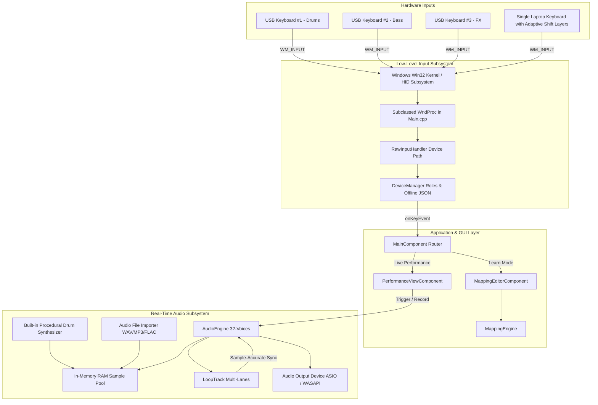

# Architecture Documentation: K3N Armoni Composer

**K3N Armoni Composer** is structured as an ultra-efficient, modular real-time audio and input system. It is designed to bridge the gap between high-level accessibility and low-level hardware performance, strictly decoupling **low-level input interception**, **sample & preset management**, **JUCE GUI components**, and the **real-time audio processing loop**.



---

## 1. Input Subsystem: `RawInputHandler` & `DeviceManager`

### Hardware Disambiguation Mechanism
Standard OS keyboard APIs deliver unified key codes regardless of the connected keyboard. To overcome this, `RawInputHandler` registers the host window using the Win32 Raw Input API with:
- `RAWINPUTDEVICE` parameters: `usUsagePage = 0x01` (Generic Desktop), `usUsage = 0x06` (Keyboard), and `dwFlags = RIDEV_INPUTSINK`.
- Upon receiving `WM_INPUT`, `GetRawInputDeviceInfoW(RIDI_DEVICENAME)` extracts the unique hardware device path:
  ```
  \\?\HID#VID_046D&PID_C31C#...#{88bae032-5a81-11e0-983c-0800200c9a66}
  ```
- This device path acts as a stable identifier for each physical USB port and connected keyboard.

### Functional Roles & Local Persistence
- `DeviceManager` binds each `DeviceId` to a musical role (`KeyboardRole::Drums`, `KeyboardRole::Bass`, `KeyboardRole::FX`, `KeyboardRole::Melody`, `KeyboardRole::Adaptive`).
- Configuration is persisted 100% locally in `%APPDATA%/LoopStation/devices.json` (zero internet / cloud dependency).

---

## 2. Real-Time Audio Engine: `AudioEngine` & `LoopTrack`

### Real-Time Safe Sampler Design
- **Zero Allocations on Audio Thread**: `getNextAudioBlock()` never performs `new`, `malloc`, or dynamic memory reallocations.
- **In-Memory Sample Cache**: All loaded audio samples (WAV, MP3, FLAC, AIFF) are pre-decoded into `juce::AudioBuffer<float>` RAM buffers upon import.
- **Built-in Procedural Starter Kit**: Synthesizes 808 kicks, resonant snares, closed hi-hats, sub-bass, and melodic synth stabs into memory on startup, ensuring instant playability without requiring external sample downloads.
- **Voice Stealing Algorithm**: 32 concurrent voices. When full, the engine transparently steals the voice furthest along in playback without audible clicks.

### Multi-Track Looper (`LoopTrack`)
- Each track records discrete timestamped trigger events: `TriggerEvent { int sampleHandle; juce::int64 offsetSamples; }`.
- During `AudioEngine::getNextAudioBlock()`, `LoopTrack::processAudioBlock()` monitors the current audio block sample window $[p, p + N)$ and triggers voices directly within the audio callback.
- Guarantees sample-accurate synchronization free from OS timer jitter.
